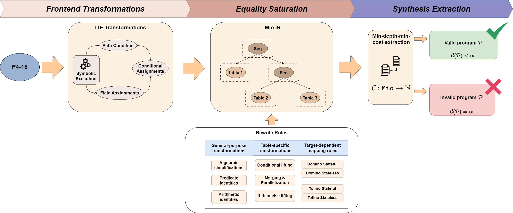
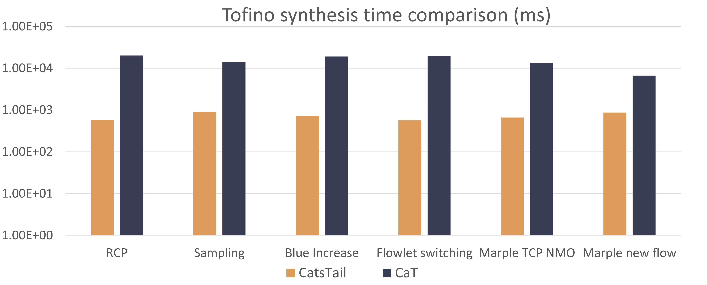
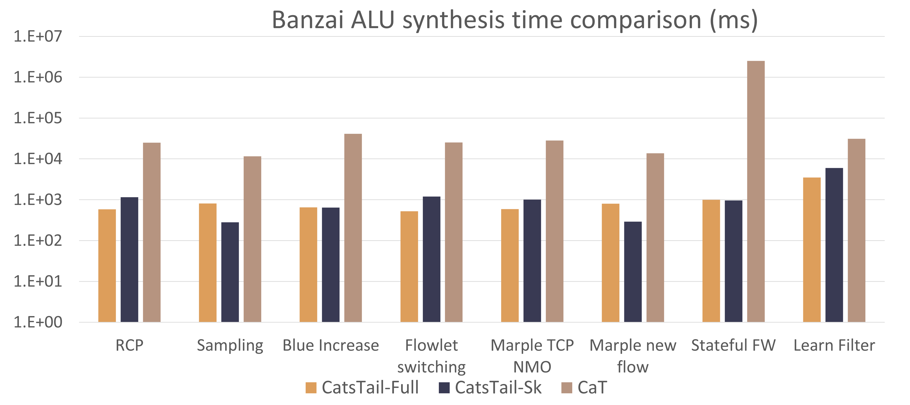
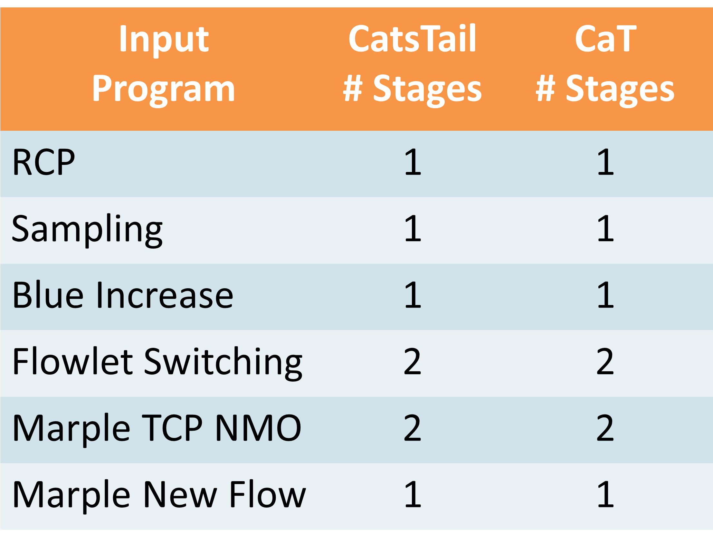
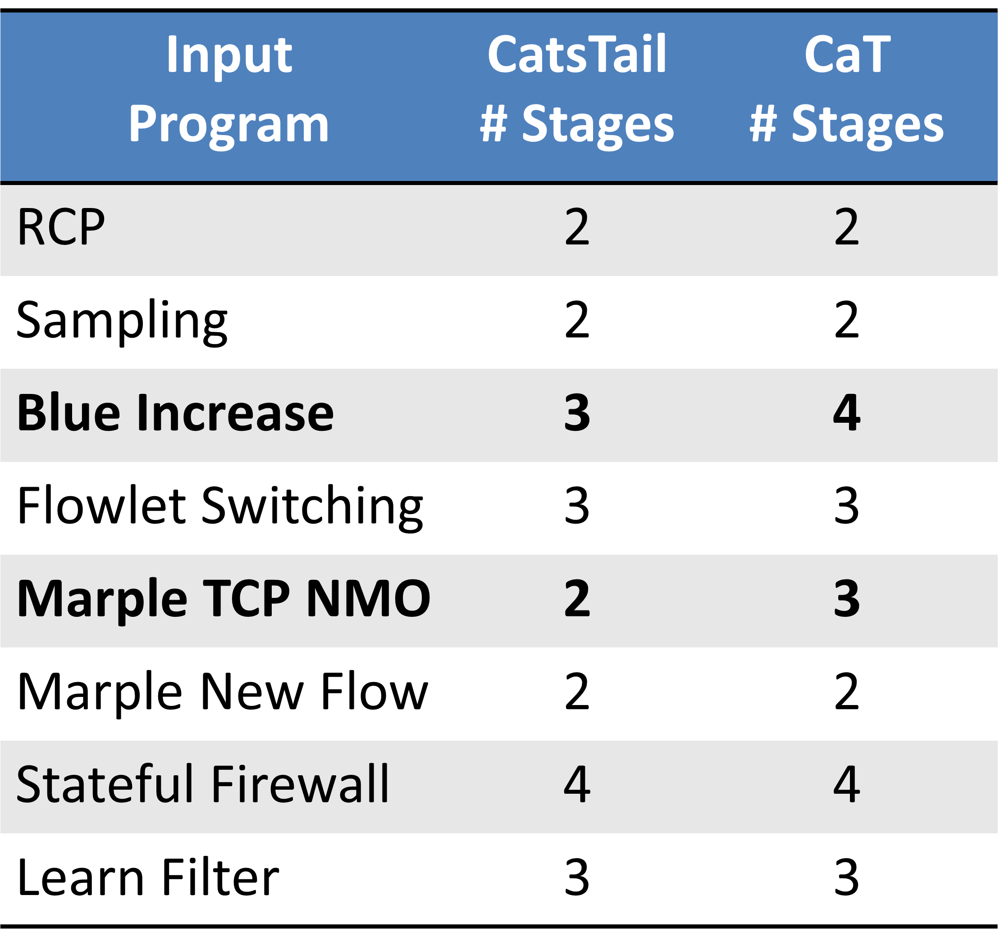

# CatsTail: Packet program synthesis via equality saturation

CatsTail is a packet program synthesizer implemented using equality saturation. An overview of the workflow is shown in the figure below:

## Design
TODO: fill in
## Representation of Tables
TODO: fill in
## General-purpose rewrite rules
TODO: fill in
[Table transformations](src/rewrites/table_transformations.rs), [algebraic simplifications](src/rewrites/alg_simp.rs), [predicate simplifications](src/rewrites/alg_simp.rs), etc.
## Target-dependent rewrites and grammar-guided rewrites
TODO: fill in
[Tofino backend](src/rewrites/tofino.rs) and [Domino backend](src/rewrites/domino.rs)
## Extraction
TODO: fill in
Extraction with target constraints.
## Synthesis comparison
### Synthesis speed
CatsTail has a much more faster synthesis speed comparing to the state-of-the-art compiler [CaT (Gao et al. 2023)](https://dl.acm.org/doi/abs/10.1145/3582016.3582036).
Tofino             |  Domino
:-------------------------:|:-------------------------:
 | 

## Stage usage
Tofino             |  Domino
:-------------------------:|:-------------------------:
  |  

For instance, Marple TCP NMP on Domino can be implemented with 2 stages, since a rewrite rule that inverts the branch condition as well as the branch actions.